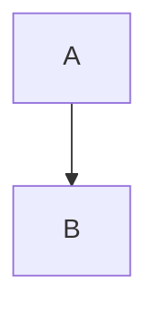

# Skill: Edit Documentation Content

Use when: adding, updating, or restructuring MDX documentation pages.

## Workflow

1. Identify the target file under `src/pages/`. Check `vocs.config.tsx` to confirm the page exists in the sidebar.
2. Read the existing file to understand its frontmatter, component imports, and content structure.
3. Make edits following the MDX conventions below.
4. Format: `bunx prettier --write <file>`
5. Verify: `bun run build` — fix any TypeScript or build errors before finishing.

## Adding a New Page

1. Create `src/pages/<section>/<slug>.mdx` with at minimum a `title` frontmatter field.
2. Add a sidebar entry in `vocs.config.tsx` under the appropriate section.
3. Run `bun run build` to verify.

## Frontmatter

```mdx
---
title: Page Title
description: Optional description for SEO and OG image.
---
```

`title` is required. `description` is optional but recommended.

## Callouts

Use GitHub-flavored admonition syntax (supported by Vocs):

```mdx
> [!NOTE]
> Informational note.

> [!WARNING]
> Something the reader should be careful about.

> [!IMPORTANT]
> Critical information.
```

## Components

Import explicitly at the top of the MDX file. Available components are in `src/components/`:

| Component | Purpose |
|---|---|
| `<ContractDeployments />` | Renders contract address tables from generated data |
| `<Libraries />` | Renders library cards |
| `<EmbedLink />` | Renders a linked card with preview |
| `<EnsipHeader />` | Header block for ENSIP pages |
| `<QandA />` | Collapsible Q&A block |

Example import in MDX:

```mdx
import { ContractDeployments } from '../../components/ContractDeployments'
```

## Mermaid Diagrams

Fenced code blocks with the `mermaid` language tag are rendered as diagrams:

````mdx

````

## Do Not Touch

- `src/data/generated/` — auto-generated JSON, overwritten on every `bun run generate`
- `src/pages/ensip/` — auto-generated MDX from the ensips script

Edits to these files will be lost on the next build.
